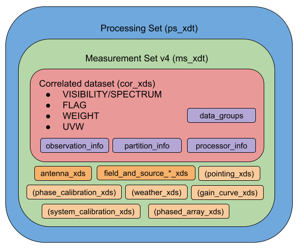
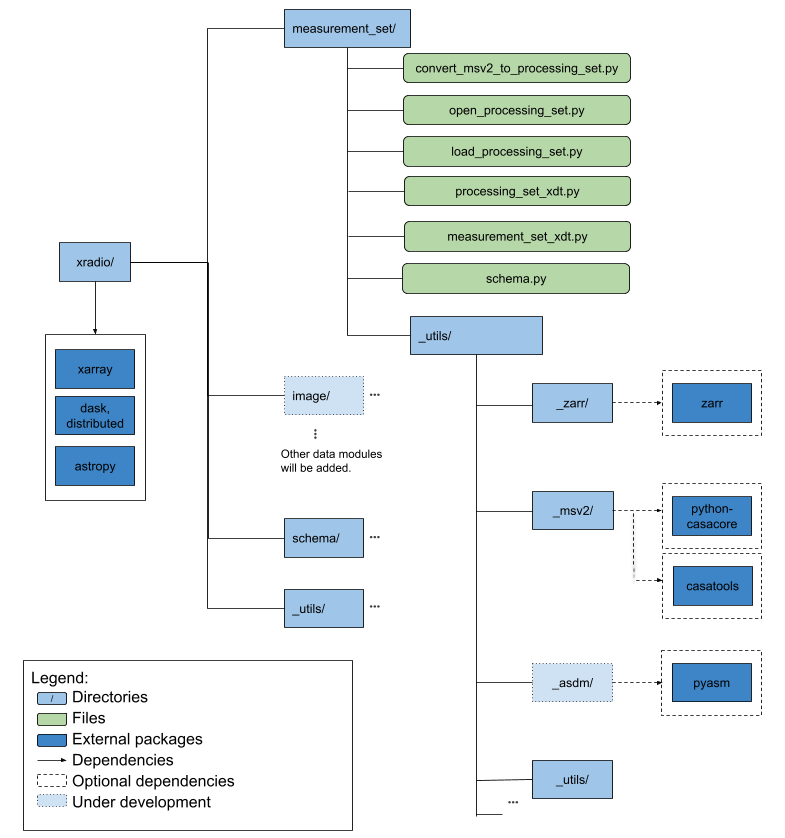
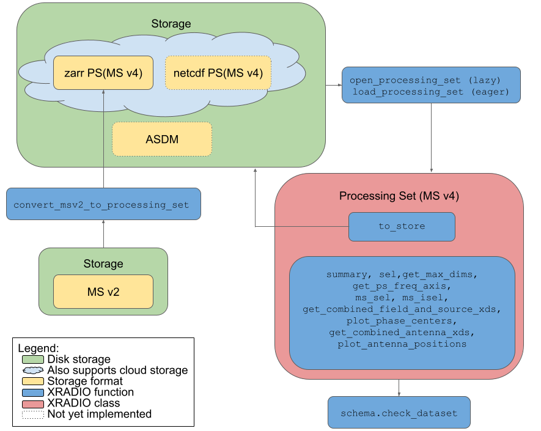

Overview
========

The Measurement Set v4 (MS v4) schema defines how correlated data
(interferometer visibilities and single-dish spectra) can be represented
in memory using datasets that consist of n-dimensional arrays labeled
with coordinates and meta-information contained in attributes (see
`Introduction <../overview.rst>`__). The MS v4 implementation differs
from the MS v2 implementation in
`casacore <https://github.com/casacore/casacore>`__ primarily in its use
of Python and off -the-shelf packages for data structures and data
serialization, contrasting with ``casacore``\ ’s bespoke C++ approach.

Reference documents consulted for the MS v4 schema design:

- `MeasurementSet definition version
  2.0 <https://casacore.github.io/casacore-notes/229.pdf>`__
- `MeasurementSet definition version
  3.0β <https://casacore.github.io/casacore-notes/264.pdf>`__
- `MeasurementSet VLBI (Very Long Baseline Interferometry)
  extensions <https://casacore.github.io/casacore-notes/265.pdf>`__
- `CASA Ephemeris
  Data <https://casadocs.readthedocs.io/en/stable/notebooks/external-data.html#Ephemeris-Data>`__
- `ASDM (Astronomy Science Data Model): SDM Tables Short
  Description <https://drive.google.com/file/d/16a3g0GQxgcO7N_ZabfdtexQ8r2jRbYIS/view>`__

The current MS v4 schema focuses on offline processing capabilities and
does not encompass all information present in the ASDM. However, its
design allows for future expansion to incorporate additional data as
needed (see `schema versioning <../overview.rst#Schema-Versioning>`__
section). It’s important to note that MS v4 is not backward compatible
with either MS v2 or MS v3, representing a significant evolution in the
data model.

Schema Layout
-------------

An xarray dataset conforming to the MSv4 schema contains data for a
single observation, spectral window, polarization setup, observation
mode, processor and beam per antenna (though finer partitioning, such as
splitting by scan or antenna, is allowed if desired). This structure
simplifies the MS v4 data representation relative to the MS v2, enabling
it to be stored as n-dimensional arrays with consistent shapes over time
(rare baseline dropouts are handled by NaN padding). Related datasets
can be grouped together into a Processing Set (``ps``), which is useful
for processing them together. Importantly, each MS v4 is fully
self-describing. As shown in Figure 1 (a simplified diagram; for full
details, see the `Data Model Schema <schema.rst>`__), the MS v4 is
structured as a dataset (``xds``) of datasets comprising the
``correlated_xds`` along with ``antenna_xds``, ``pointing_xds``,
``phase_calibration_xds``, ``weather_xds``, ``system_calibration_xds``,
``gain_curve_xds``, and ``phased_array_xds``, all stored in the
attribute section. The ``correlated_xds`` contains the ``VISIBILITY``
(for interferometer data) or ``SPECTRUM`` (for single dish data),
``UVW``, ``WEIGHT``, and ``FLAGS`` data variables, along with info
dictionaries in the attributes. The ``field_and_source_xds`` is
specifically stored within the attributes of the
``VISIBILITY``/``SPECTRUM`` data variable.

.. raw:: html

   <!-- Source Google Drawings of the diagrams are in gdrive: CASA/Documentation/XRADIO/Diagrams -->

  Figure 1: Processing Set and MS v4 schema layout. Optional datasets are indicated by round brackets. Data variables are capitalized. The suffix '_xds' denotes an xarray Dataset, while the suffix 'xdt' denotes an xarray DataTree. '_info' indicates metadata dictionaries.

Data Groups
-----------

The ``correlated_xds`` can contain multiple copies of
``VISIBILITY``/``SPECTRUM``, ``FLAG``, ``WEIGHT``, and ``UVW`` data
variables. To maintain the relationship between a set of data variables,
the ``data_groups`` dictionary can contain one or more data group
definitions. A ``data_group`` dictionary is used with fixed lowercase
keys: ‘correlated_data’, ‘flag’, ‘weight’, ‘uvw’, and other metadata.

The ``data_groups`` dictionary is stored as an attribute of the
correlated (main) dataset (``ms_xds``) and can contain one or more
``data_group``\ s. Data variables can be shared between
``data_group``\ s or be unique to a specific group. For example, you
might have a ‘base’ group and an ‘imaging’ group:

.. code:: python

   Example: ms_xds.attrs['data_groups'] = {
      'base': {'correlated_data': 'VISIBILITY', 'flag': 'FLAG', 'weight': 'WEIGHT', 'uvw': 'UVW'}, 
      'imaging': {'correlated_data': 'VISIBILITY_CORRECTED', 'flag': 'FLAG', 'weight': 'WEIGHT_IMAGING', 'uvw': 'UVW'}
   }

The ‘base’ and ‘imaging’ ``data_group``\ s share the same ‘flag’ and
‘uvw’ data variables but have different ‘correlated_data’ and ‘weight’
data variables. When creating new versions of data variables, they must
contain the standard name followed by an underscore and a description
chosen by the developer. For example, a new version of ``VISIBILITY``
could be ``VISIBILITY_PHASE_SHIFTED``.

The ``ms_xds`` also allows for selecting a ``data_group``. For example:

.. code:: python

   sub_ms_xds = ms_xds.xr_ms.sel(data_group_name='imaging')

Use Cases
---------

The MS v4 has been designed to satisfy the following use cases:

- Radio Interferometry
- Single Dish Observations
- On-the-fly (OTF) Mosaic Observations
- Ephemeris Observations
- Heterogeneous Antenna VLBI
- Phased Array Stations (PAS)
- Phased Array Feeds (PAF)

To ensure that these use cases are met, we have created stakeholder
tests that convert MS v2 to MS v4 using the
`convert_msv2_to_processing_set <api.rst#xradio.measurement_set.convert_msv2_to_processing_set>`__
function. These tests cover a wide selection of instruments:

Interferometer Stakeholder Tests
~~~~~~~~~~~~~~~~~~~~~~~~~~~~~~~~

+--------------------------------------------------------------+-------------+---------+-------------+------+-----+-----+
| Dataset                                                      | Telescope   | Mosaic  | Ephemeris   | VLBI | PAS | PAF |
+==============================================================+=============+=========+=============+======+=====+=====+
| Antennae_North.cal.lsrk.split.ms                             | ALMA        | x       |             |      |     |     |
+--------------------------------------------------------------+-------------+---------+-------------+------+-----+-----+
| AA2-Mid-sim_00000.ms                                         | Simulated   |         |             |      |     |     |
|                                                              | SKA Mid     |         |             |      |     |     |
+--------------------------------------------------------------+-------------+---------+-------------+------+-----+-----+
| ska_low_sim_18s.ms                                           | Simulated   |         |             |      |     | x   |
|                                                              | SKA Low     |         |             |      |     |     |
+--------------------------------------------------------------+-------------+---------+-------------+------+-----+-----+
| small_meerkat.ms                                             | MeerKAT     |         |             |      |     |     |
+--------------------------------------------------------------+-------------+---------+-------------+------+-----+-----+
| small_lofar.ms                                               | LOFAR       |         |             |      | x   |     |
+--------------------------------------------------------------+-------------+---------+-------------+------+-----+-----+
| global_vlbi_gg084b_reduced.ms                                | VLBA+EVN    |         |             | x    |     |     |
+--------------------------------------------------------------+-------------+---------+-------------+------+-----+-----+
| VLBA_TL016B_split.ms                                         | VLBA        |         |             | x    |     |     |
+--------------------------------------------------------------+-------------+---------+-------------+------+-----+-----+
| ngEHT_E17A10.0.bin0000.source0000_split.ms                   | Simulated   |         |             | x    |     |     |
|                                                              | ngEHT       |         |             |      |     |     |
+--------------------------------------------------------------+-------------+---------+-------------+------+-----+-----+
| venus_ephem_test.ms                                          | ALMA        | x       | x           |      |     |     |
+--------------------------------------------------------------+-------------+---------+-------------+------+-----+-----+
| ALMA_uid\_\__A002_X1003af4_X75a3.split.avg.ms                | ALMA        | x       | x           |      |     |     |
+--------------------------------------------------------------+-------------+---------+-------------+------+-----+-----+
| SNR_G55_10s.split.ms                                         | VLA         | x       |             |      |     |     |
+--------------------------------------------------------------+-------------+---------+-------------+------+-----+-----+
| VLASS3.2.sb45755730.eb46170641.60480.16266136574.split.v6.ms | VLA (VLASS) | x       |             |      |     |     |
+--------------------------------------------------------------+-------------+---------+-------------+------+-----+-----+
| gmrt.ms                                                      | GMRT        |         |             |      |     |     |
+--------------------------------------------------------------+-------------+---------+-------------+------+-----+-----+
| askap_59750_altaz_2settings.ms                               | ASKAP       |         |             |      |     | x   |
+--------------------------------------------------------------+-------------+---------+-------------+------+-----+-----+
| askap_59754_altaz_2weights_0.ms                              | ASKAP       |         |             |      |     | x   |
+--------------------------------------------------------------+-------------+---------+-------------+------+-----+-----+
| askap_59754_altaz_2weights_15.ms                             | ASKAP       |         |             |      |     | x   |
+--------------------------------------------------------------+-------------+---------+-------------+------+-----+-----+
| askap_59755_eq_interleave_0.ms                               | ASKAP       |         |             |      |     | x   |
+--------------------------------------------------------------+-------------+---------+-------------+------+-----+-----+
| askap_59755_eq_interleave_15.ms                              | ASKAP       |         |             |      |     | x   |
+--------------------------------------------------------------+-------------+---------+-------------+------+-----+-----+

Single Dish Stakeholder Tests
~~~~~~~~~~~~~~~~~~~~~~~~~~~~~

+------------------------------------+-----------+--------------+------------+-----------+------------+
| Dataset                            | Telescope | Multi-Target | OFF        | Ephemeris | Scan       |
|                                    |           |              | Position   |           | Pattern    |
+====================================+===========+==============+============+===========+============+
| sdimaging                          | GBT       |              | relative   |           | raster     |
+------------------------------------+-----------+--------------+------------+-----------+------------+
| uid\_\__A002_Xced5df_Xf9d9.small   | ALMA      |              | horizontal |           | raster     |
+------------------------------------+-----------+--------------+------------+-----------+------------+
| uid\_\__A002_X1015532_X1926f.small | ALMA      |              | relative   | x         | raster     |
+------------------------------------+-----------+--------------+------------+-----------+------------+
| uid\_\__A002_Xe3a5fd_Xe38e.small   | ALMA      | x            | absolute   |           | raster     |
+------------------------------------+-----------+--------------+------------+-----------+------------+
| uid\_\__A002_Xae00c5_X2e6b.small   | ALMA      |              | relative   | x         | fast       |
+------------------------------------+-----------+--------------+------------+-----------+------------+

- OFF position column, possible values:

  - **absolute**: OFF position has its own field entry in the FIELD
    table.
  - **relative**: OFF is a fixed position specified as an offset
    coordinate relative to the ON position.
  - **horizontal**: OFF is also an offset position relative to the ON
    position but specified so that its elevation value is always close
    to the ON position (meaning that the OFF position is moving with
    time).

- Scan pattern column: raster scan/fast scan.

  - **raster**: Scan is, as the name indicates, a raster pattern with a
    relatively long integration time (0.1-1 sec) and channelized
    spectral window.
  - **fast**: Scan is either a Lissajous or double-circle pattern with
    short integration time (1 msec) and single-channel spectral window.

Translating between MS v2 and MS v4
-----------------------------------

+-------------------+--------------------------------------+--------------------+
| MS v2 table       | MS v4 Access Pattern                 | Xarray Type        |
+===================+======================================+====================+
| MAIN              | ms_xdt                               | datatree           |
+-------------------+--------------------------------------+--------------------+
| SCAN              | ms_xdt.scan_name                     | coord              |
+-------------------+--------------------------------------+--------------------+
| POLARIZATION      | ms_xdt.polarization                  | coord              |
+-------------------+--------------------------------------+--------------------+
| SPECTRAL_WINDOW   | ms_xdt.frequency                     | coord              |
+-------------------+--------------------------------------+--------------------+
| DOPPLER           | ms_xdt.frequency                     | coord              |
+-------------------+--------------------------------------+--------------------+
| FIELD             | ms_xdt.field_and_source_base_xds     | dataset            |
+-------------------+--------------------------------------+--------------------+
| EPHEMERIDES       | ms_xdt.field_and_source_base_xds     | dataset            |
+-------------------+--------------------------------------+--------------------+
| SOURCE            | ms_xdt.field_and_source_base_xds     | dataset            |
+-------------------+--------------------------------------+--------------------+
| OBSERVATION       | ms_xdt.observation_info              | dict               |
+-------------------+--------------------------------------+--------------------+
| PROCESSOR         | ms_xdt.processor_info                | dict               |
+-------------------+--------------------------------------+--------------------+
| ANTENNA           | ms_xdt.antenna_xds                   | dataset            |
+-------------------+--------------------------------------+--------------------+
| FEED              | ms_xdt.antenna_xds                   | dataset            |
+-------------------+--------------------------------------+--------------------+
| PHASED_ARRAY      | ms_xdt.phased_array_xds              | dataset            |
+-------------------+--------------------------------------+--------------------+
| POINTING          | ms_xdt.pointing_xds                  | dataset            |
+-------------------+--------------------------------------+--------------------+
| SYSCAL            | ms_xdt.system_calibration_xds        | dataset            |
+-------------------+--------------------------------------+--------------------+
| WEATHER           | ms_xdt.weather_xds                   | dataset            |
+-------------------+--------------------------------------+--------------------+
| GAIN_CURVE        | ms_xdt.gain_curve_xds                | dataset            |
+-------------------+--------------------------------------+--------------------+
| PHASE_CAL         | ms_xdt.phase_calibration_xds         | dataset            |
+-------------------+--------------------------------------+--------------------+
| EARTH_ORIENTATION | ms_xdt.earth_orientation_xds         | dataset            |
+-------------------+--------------------------------------+--------------------+

Summary of Key Changes
----------------------

The following changes and deprecations are relative to MS v2. Some of
the changes from MS v3 are adopted.

- An MS v4 is fully self-describing and contains the information for a
  single observation, spectral window, polarization setup, observation
  mode, processor, and beam per antenna.
- Data is stored in Datasets of labeled n-dimensional arrays (called
  data variables) instead of tables.
- The table concept of rows has been replaced by relevant dimensions.
  For example, the ``VISIBILITY`` column in the ``MAIN table`` of MS v2
  is now an n-dimensional array with dimensions time x baseline x
  frequency x polarization (row has been split into time x baseline).
- Most keys that used to be implicit numbered indices have been changed
  to descriptive names. This improves code readability, allows for
  sub-selecting data without reindexing, and enables easy data
  combination. For example, ``antenna_name`` is used instead of
  ``antenna_id``.
- The concept of data description (DDI) is deprecated and replaced by
  ``spectral_window_name`` and ``polarization_setup``.
- Versioning of the ``VISIBILITY``/``SPECTRUM``, ``WEIGHT``, ``UVW``,
  and ``FLAG`` data variables is done using `data
  groups <overview.rst#Data-Groups>`__.
- The `JPL Horizons
  ephemerides <https://casadocs.readthedocs.io/en/latest/notebooks/external-data#Ephemeris-Data>`__
  was used to create the ephemeris schema instead of the MS v2.
- Redefinition of ``WEIGHT`` to be ``WEIGHT_SPECTRUM``. Contemporary
  interferometers are spectral machines; consequently, weights can be
  distinctive per channel. The ``WEIGHT`` data variable has the same
  shape as the ``VISIBILITY``/``SPECTRUM`` data variable.
- Field, source, and ephemeris data have been combined into a single
  dataset.
- Antenna and feed data have been combined into a single dataset (an MS
  v4 can only have one feed type per antenna).

Deprecation List MS v2
~~~~~~~~~~~~~~~~~~~~~~

- ``MAIN Table``

  - ``WEIGHT_SPECTRUM`` (Now called ``WEIGHT``).
  - ``FLAG_CATEGORY``: ``FLAG`` versioning can now be done with `data
    groups <overview.rst#Data-Groups>`__, and
    `FlagArray <schema.rst#xradio.measurement_set.schema.FlagArray>`__
    supports bit fields now
  - ``FLAG_ROW``: The purpose of ``FLAG_ROW`` was to avoid having to
    renumber rows when e.g. removing an antenna. This is not necessary
    with data variables that are labeled since implicit indices are no
    longer used.
  - ``SIGMA``: This is redundant since ``WEIGHT`` is always considered
    to be ``1/SIGMA^2``.
  - ``BASELINE_REFERENCE``: This is no longer used in VLBI.

- ``FIELD Table``

  - ``FIELD_DELAY_CENTER``: No use case has been found.
  - ``EPHEMERIS_ID``: Only a single ephemeris dataset per MS v4 is
    permitted.

- ``ANTENNA Table``:

  - ``OFFSET``: No use case has been found.

- ``FEED Table``:

  - ``POL_RESPONSE``, ``BEAM_OFFSET``, ``POSITION``: Not effectively
    used and will be replaced by a beam model dataset which is under
    development.

- ``POINTING Table``:

  - ``TARGET``, ``SOURCE_OFFSET``, ``ON_SOURCE``: Redundant information
    contained in ``field_and_source_xds``.
  - ``TRACKING``: No use case has been found.

Delving further
---------------

To delve further into the Measurement Set v4,

1. The `tutorial <tutorials_guides.rst>`__ section demonstrates the
   schema and API usage.

   - This Jupyter notebook (.ipynb) can be run interactively via the
     Google Colab link at the top.
   - You can also download and run notebooks locally after installing
     XRADIO via pip or conda.

2. There are multiple `guides <tutorials_guides.rst>`__

   - Examples show how different telescopes’ data can be represented.
   - If your telescope isn’t represented, open an issue and attach an
     example Measurement Set v2 (preferably 10MB or smaller).

3. Examine the MSv4 `schema <schema.rst>`__ and `API
   documentation <api.rst>`__.
4. The MSv4 schema went through a review process in late 2024 / early
   2025. More details and discussion on the schema design are in the
   `MSv4 Review Panel
   report <https://github.com/casangi/xradio/tree/main/docs/source/reviews/MSv4_review_panel_report_20250106_v1.1.pdf>`__
   and the `discussion issues on the XRADIO GitHub
   repository <https://github.com/casangi/xradio/issues?q=is%3Aissue%20label%3A%22MSv4%20Review%22&page=1>`__
   (with label “MSv4 Review”).

Sub-package Layout
------------------

The XRADIO architecture with the measurement set sub-package expanded is
shown in Figure 2 (`overview of XRADIO
architecture <../development.rst>`__). The public API is contained in
the top-level ``.py`` files of the ``measurement_set`` sub-package (`API
documentation <api.rst>`__).

.. raw:: html

   <!-- Source Google Drawings of the diagrams are in gdrive: CASA/Documentation/XRADIO/Diagrams -->

      Figure 2: XRADIO Architecture.

Figure 3 summarizes the available and planned future functionality. The
sub-package currently allows direct opening of data from
`zarr <https://zarr-specs.readthedocs.io/en/latest/specs.html>`__ and
will support ASDM pre- and post- WSU (ALMA Wide Band Sensitivity
Upgrade) and possibly
`NetCDF <https://www.unidata.ucar.edu/software/netcdf/>`__ in the
future. The WSU ASDM is an update of the
`ASDM <https://drive.google.com/file/d/1PMrZFbkrMVfe57K6AAh1dR1FalS35jP2/view>`__
implementation required by `ALMA
WSU <https://science.nrao.edu/facilities/alma/science_sustainability/wideband-sensitivity-upgrade>`__
where the spectral windows are no longer interleaved. Both zarr and
NetCDF support cloud storage, and
`open_processing_set <api.rst#xradio.measurement_set.open_processing_set>`__
and
`load_processing_set <api.rst#xradio.measurement_set.load_processing_set>`__
support accessing data on `Amazon S3 <https://aws.amazon.com/s3/>`__.
There are no plans to support direct access to MS v2, since the repeated
reordering of data to MS v4 has been found to be computationally
prohibitively expensive. Rather, data should be converted using the
`convert_msv2_to_processing_set <api.rst#xradio.measurement_set.convert_msv2_to_processing_set>`__.

.. raw:: html

   <!-- Source Google Drawings of the diagrams are in gdrive: CASA/Documentation/XRADIO/Diagrams -->

  Figure 3: Measurement Set Sub-package Current and Planned Functionality.

Future work
-----------

Schema-related:

- Earth orientation dataset (VLBI)
- Interferometer model dataset (VLBI)
- Beam model dataset

Software-related:

- Expand and refine Processing Set methods
- Add ASDM and WSU-ASDM backend
- Possibly add a NetCDF backend
- Replace python-casacore backend with a more lightweight (possibly pure
  Python) package
