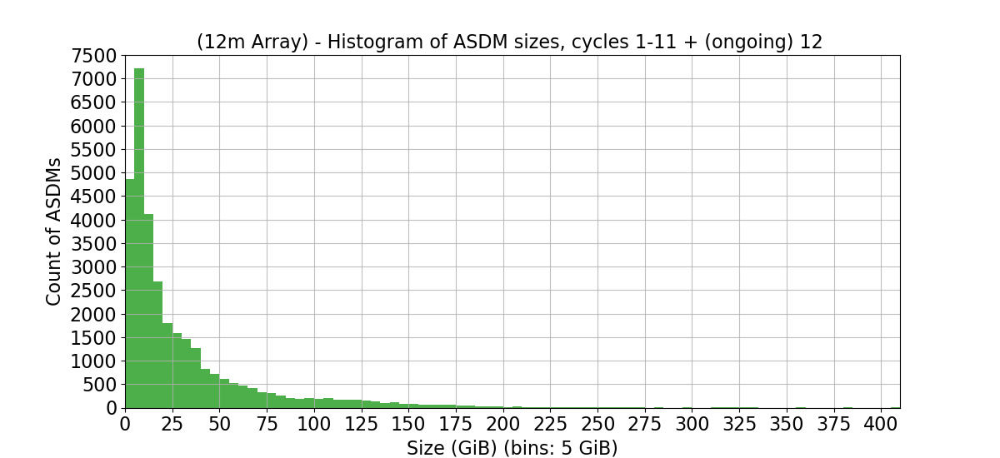
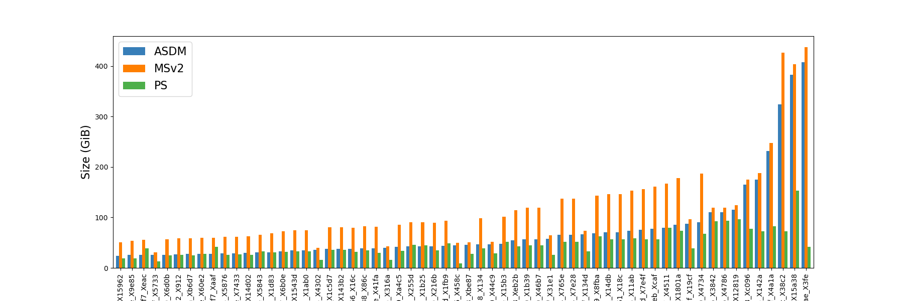
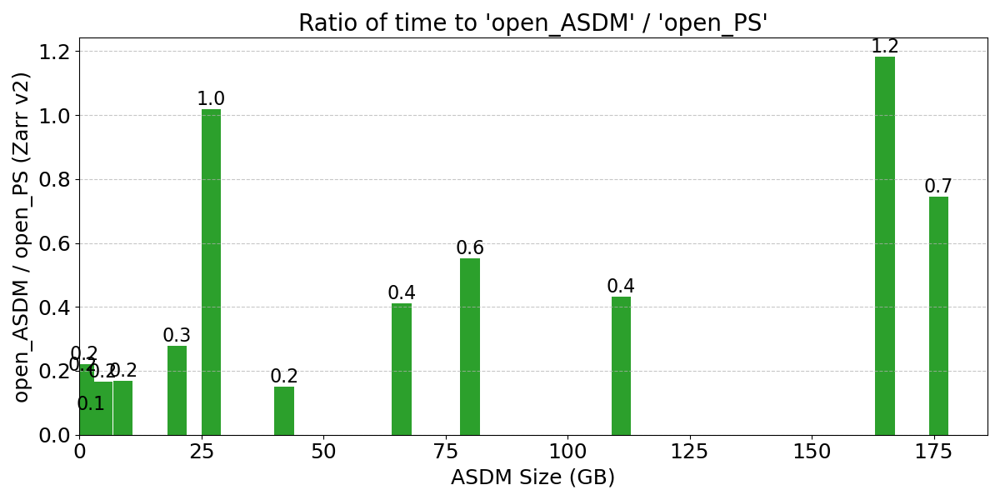
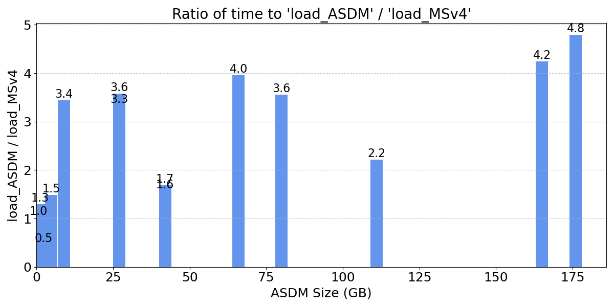
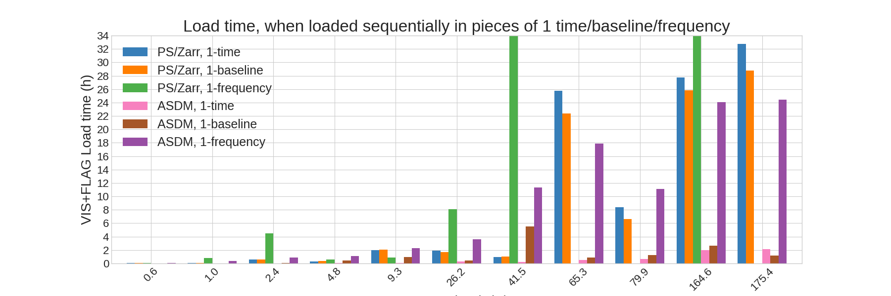
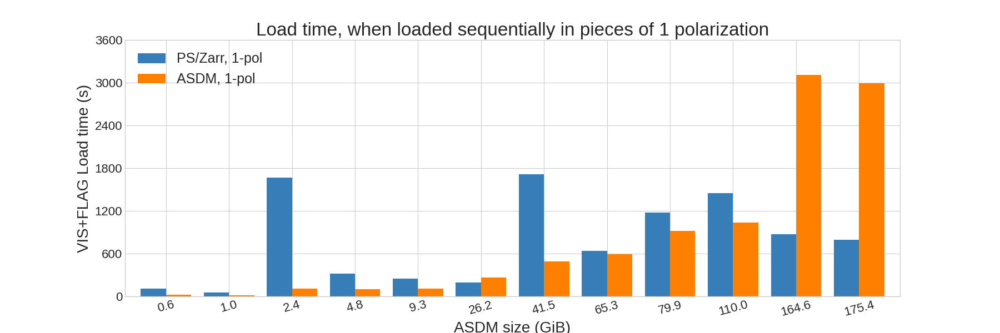
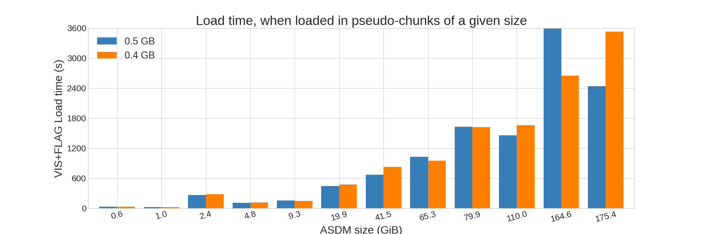

# ASDM backend performance

This document provides general performance notes for the ASDM backend of XRADIO when loading ASDMs into
Processing Sets (sets of MSv4s). It includes performance-oriented comparisons between the XRADIO ASDM backend
and the native XRADIO Processing Set/Zarr format. It also details the benchmark datasets used for these
comparisons and highlights remaining performance gaps and planned improvements.

This is a work in progress; performance results are expected to evolve as the ASDM backend implementation
stabilizes. In particular, the following optimizations are expected to significantly impact performance:

* **Pointing table loading:** Comparisons currently exclude loading the Pointing table from ASDMs. While an
  initial implementation exists, its performance is well below par. Planned optimizations for loading binary
  tables are under development (see pyasdm issues [#28](https://github.com/casangi/pyasdm/issues/28) and
  [#30](https://github.com/casangi/pyasdm/issues/30)).
* **Access pattern optimizations:** Fine-tuning indexing and data loading routines within the ASDM backend for
  various access patterns (partially related to the next point).
* **Use-Case optimizations:** Targeted performance tuning tailored to specific use cases.

---

## Datasets

The benchmarks rely on the following sets of ASDM datasets.

### Pipeline Data
The largest dataset collection is pulled from the ALMA Pipeline Working Group benchmark set (2025 version),
totaling 209 ASDMs with a aggregate size of 3.9 TB.

A representative subset of 12 ASDMs (ranging from 0.6 GB to 175 GB) is designated as the
**ALMA ASDM Benchmark Compact** set. This subset includes observations from both the 7-meter and 12-meter arrays.

### TelCal Unit Tests

A smaller collection of 52 ASDMs (185 GB total) exercising non-pipelinable TelCal calibration scan types. These
ASDMs can be found in the ALMA software repository's TelCal subsystem. They serve as valuable edge-case tests
for various ALMA array configurations.

### Very Large ASDMs

A selection of four among the largest ASDMs available in the ALMA archive for Cycles 1–11 (up to March 2026):

| ASDM (ExecBlock UID) | Size (GB) |
|---|---|
| `uid___A002_Xc3412f_X4a1a` | 232 |
| `uid___A002_X10ac6bc_X38c2` | 324 |
| `uid___A002_X12f828c_X15a38` | 383 |
| `uid___A002_Xf2e8ae_X3fe` | 408 |

These datasets were selected as a few representative cases from the histogram of ASDM sizes below:

Note: These very large ASDMs are not used consistently across all benchmark runs due to memory constraints in
the MSv2 $\rightarrow$ MSv4 converter and impractical execution times within shared test environments,
especially given the opportunistic approach used to run benchmarks tests in the available hardware.

### Aggregated Dataset Metrics

The total size of the set of ASDMs is, in the different formats used:

| Format | Size (TB) |
|---|---|
| ASDM | 4.2 |
| MSv2 | 7.0 |
| Processing Set (MSv4) | 3.2 |

* **ASDM:** Retrieved directly from the ALMA archive.
* **MSv2:** Produced taking the ASDMs as inputs and using importasdm in CASA
* **MSv4:** Generated from MSv2s via the XRADIO converter.

The following bar plot shows the sizes of the ~60 larger ASDMs, in the different formats used:

---

## Hardware Environment

This section provides an approximate description of the hardware setup used, for reference and possible
comparisons in the future. Benchmarks were executed on non-distributed file systems (excluding Lustre or
equivalent distributed storage) using two system configurations:

* **`dev07` / `perf07` containers** (OS: Rocky Linux 8)
* **`dev01` containers** (OS: ALMALinux 9)

### System Specifications

* **`dev07` / `perf07` Host:** AMD EPYC 7413 24-Core processor @ 1.5 GHz, 251 GiB RAM, 512 KB L1 cache, ~5290
  bogomips, TLB of 2560 4K pages.
  * **`dev07` container allocation:** 73 GiB RAM.
  * **`perf07` container allocation:** Full system RAM (251 GiB).
* **`dev01` Host:** AMD EPYC 9355P 32-Core processor @ 1.5 GHz, 251 GiB RAM, 1024 KB L1 cache, ~7090 bogomips,
  TLB of 192 4K pages.

### Storage & Workload Considerations

Both systems share the same disk array. The `dev07`/`perf07` host is directly attached via fiber channel,
whereas `dev01` accesses the storage array via NFS through `dev07`. 

The disk array has sufficient storage for repeated tests with the datasets listed above. A comparison with a
different system such as lustre is to be done. For the initial rounds of performance comparisons it was preferred
to use a simpler system rather than the lustre file systems used at the ALMA executives, to avoid their
performance peculiarities and complications.

Most of the tests and comparisons described below have been run on the "dev07" / "perf07" hardware. The competing
workload has been at times signficant and largely unpredictable, with very intense short-lived processes (for
example 8-10 processes for a few minutes or tens of minutes), and longer milder workload. As such the run times
should be taken as approximate estimates rather than strict hard baselines.

---

## Performance Comparisons: ASDM Backend vs. PS/Zarr Format

These comparisons were made throughout the months of April-June 2026, using the main branch corresponding to the
XRADIO versions available until the end of June (1.1.2 to 1.2.2) plus the changes added in the branch of the
XRADIO issue #454 (ASDM backend addition).

Three different approaches are considered. Here by loading all the data we mean loading the VISIBILITY and FLAG
data variables of the MSv4s:

1. **Full Partition Loading:** Loading all data for a single MSv4 partition at once.
2. **Single-Item Slicing:** That is, loading all the data for one integration, or one baseline,
   or one frequency, or one polarization.
3. **Chunk-Emulated Slicing:** Loading the data in slices that emulate the chunks of the Processing Set/Zarr
   format, in particular slices for a given chunk size with balanced dimension lenghts, as produced in the MSv4
   converter (`main_chunksize`) parameter.

---

### 1. Full MSv4 Partition Loading

An initial comparison of the ASDM backend against the PS/Zarr format of XRADIO was performed using the simplest
access pattern or approach to loading the data: load full partitions at once. 

The following bar plot shows the ratio between an open operation in the ASDM backend versus and open operation
on a Zarr version of the equivalent Processing Set:

As the ASDM backend has been and is expected to keep evolving, this is a first reference comparison. These
comparisons date back to early 2026 (Jan-Feb). They need to be updated as backend development progresses.

---

### 2. Single-item slicing by time, baseline, and frequency

This approach defines slices that are as as thin as possible along one dimension at a time, while taking all the
data along the other dimensions.

The load time results for the "ALMA ASDM benchmark compact", when loading the data:

- **1 time unit (integration):** All baselines, frequencies and polarizations are loaded at once.
  This approach is similar to the way the CASA visibility iterator/buffer loads data from MSv2s.

- **1 baseline:** All times, frequencies and polarizations loaded at once. 

- **1 frequency:** All times, baselines and polarizations loaded at once.

For ALMA datasets (up to ~1,000–1,200 baselines), the third case (**1 frequency**) is the one with the
highest potential for overheads and slow downs, particularly for partitions with several thousands of channels.

For the first and second case (loading by time and by baseline), the partitions with only one frequency were
skipped to reduce the overheads of repeated loads for tiny amounts of data, at least partially. Such partitions
are produced from the input ASDMs for channel average or WVR SPWs for example).

The load times for the "ALMA ASDM benchmark compact" are summarized in the following bar plot:

Note: Missing (green) bars for some of the larger datasets correspond to runs that took overly long and had to be
stopped before finishing (for example more than 86 hours for the 41.5 GB ASDM, or more than 135 hours for the
164.6 GB ASDM).

---

### 3. Slicing by Polarization

This represents a more rare case that could perhaps be of interest for single dish data processing. The load time
results for the "ALMA ASDM benchmark compact", when loading the data in pieces of 1 polarization (all times,
baselines and frequencies at once) are summarized in the following bar plot:

---

### 4. Emulated Chunk-Size Slicing

These benchmarks evaluate how the ASDM backend responds to chunking patterns typical of Zarr-backed Processing
Sets in the VIPER/RADPS processing framework.

Unlike Zarr, the chunks do not represent or relate directly to the format on disk, as the ASDM has a predefined
binary data format that does not consider chunking.
The data arrays are loaded in slices. These slices emulate the chunks of Zarr-backed Processing Sets. The slice
lengths along every dimension are calculated using the same mechanism as in the `main_chunksize` parameters of
the MSv2 $\rightarrow$ MSv4 converter (function `mem_chunksize_to_dict()` included in the converter).

The following graph shows the data load times of the ASDM Backend when using different chunk sizes, for the
"ALMA ASDM benchmark compact". To be done: scan a wider range of chunk sizes.

